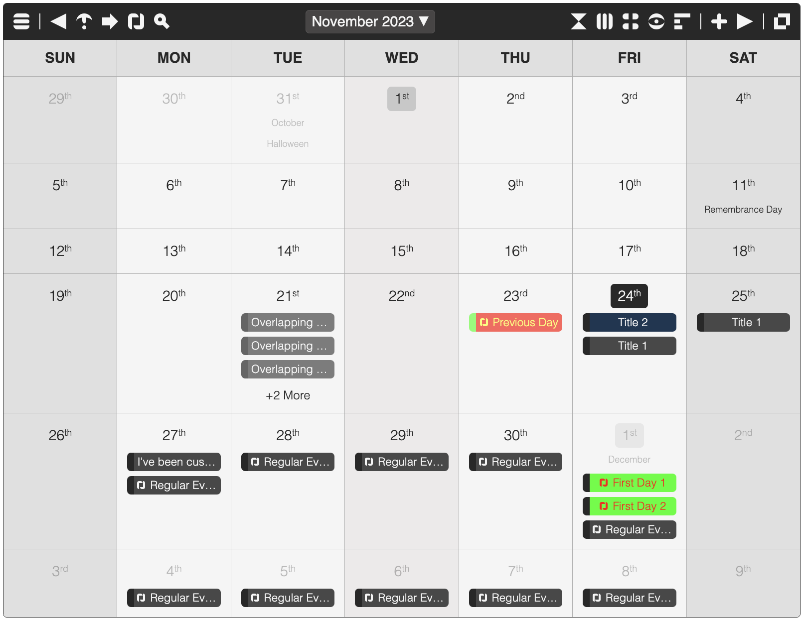
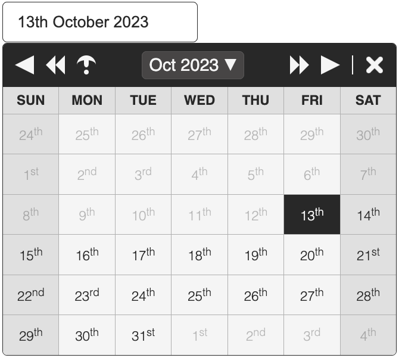

<h1 align="center">
Calendar.js

[](https://twitter.com/intent/tweet?text=Calendar.js%2C%20a%20free%20JavaScript%20library&url=https://github.com/williamtroup/Calendar.js&hashtags=calendar,javascript,responsive,events)
</h1>
<p align="center">One of the world's easiest, most powerful, and fully responsive JavaScript Calendars!</p>
<p align="center">v2.7.1</p>
<br />





<h1>What features does Calendar.js have?</h1>

- Zero-dependencies!
- Adding, updating, and removing events, with full custom colors support.
- Full API available via public functions.
- Drag and Drop for events, even across multiple Calendars!
- Drag and Drop for moving events to new times, and resizing to adjust event durations (in Full Day/Week views).
- Cut, Copy, Paste (with multi-select support), and Duplication of events.
- Configurable text for translations (see "dist/translations" for languages already available).
- Day, Week, Month, Year, and All Events views.
- Fully styled in CSS/SASS (including the buttons) and compatible with the Bootstrap library.
- Full CSS color themes support (using :root variables, with dark-mode support).
- Custom triggers for actions (adding/updating/removing events, skipping months, etc.).
- Export events to CSV, XML, JSON, TEXT, iCAL, MD, HTML, and TSV, with system clipboard setting support.
- Import events from iCAL and JSON files.
- Full-screen mode (double-clicking the title bar).
- Search support (with search history).
- Repeat every Day, Week, Month, Year, or a custom period (with exclusion days support).
- Customizable holidays.
- Shortcut keys (click [here](docs/SHORTCUT_KEYS.md) to see the full list).
- Custom event groups (with configurable toggles via the side menu).
- Browser notifications for events, with offset support (modern browsers only).
- Drop file support (allowing a file containing JSON, or an array of events, to be added).
- DatePicker mode (just assign to the ID of a text input).
- HTML text support (off by default).
- jQuery plugin for quickly creating Calendars.
- Data-Binding support to quickly create new Calendars without writing Javascript!
- Popup notifications for actions (adding/updating/deleting events, updating configuration, etc.).
- Start of week support (Monday, Saturday, or Sunday).
- Local storage support for events!
<br />
<br />

<h1>What browsers are supported?</h1>

All modern browsers (such as Google Chrome, FireFox, and Opera) are fully supported.

Limited support is still available for Internet Explorer. However, use within this browser is not recommended.
<br>
<br>

<h1>What are the most recent changes?</h1>

To see a list of all the most recent changes, click [here](docs/CHANGE_LOG.md).
<br>
<br>

<h1>How do I get started?</h1>

To get started using Calendar.js, do the following steps:
<br>
<br>

### 1. Prerequisites:

Make sure you include the "DOCTYPE html" tag at the top of your email, as follows:

```markdown
<!DOCTYPE html>
```
<br>

### 2. Include Files:

```markdown
<link rel="stylesheet" href="dist/calendar.js.css" />
<script src="dist/calendar.js"></script>
```
<br>

### 3. Create DOM Container:

```markdown
<div id="calendar"></div>
```
<br>

### 4. Initialize Calendar.Js:

```markdown
<script> 
  var calendarInstance1 = new calendarJs( "calendar", {
    manualEditingEnabled: true
    // All your options can be set here
  } );

  // OR
  var calendarElement = document.getElementById( "calendar" );
  var calendarInstance2 = new calendarJs( calendarElement, {
    manualEditingEnabled: true
    // All your options can be set here
  } ); 
</script>
```

<br>

To see the options available for the class constructor, click [here](docs/CLASS.md).  You can also create new Calendars using the jQuery Plugin, or by using Data Bindings.  See the test HTML files for examples.
<br>
<br>

### 5. Finishing Up:

That's it! Nice and simple. Please refer to the code if you need more help (fully documented).
<br>
<br>

<h1>How do I go about customizing Calendar.js and add events?</h1>

To customize, and get more out of Calendar.js, please read through the following documentation.
<br>
<br>

### 1. Options:

Options (which can be set when initializing, or afterwards) allow you to customize how Calendar.js will look and function.  The options are also used to set the custom triggers you want to fire when specific actions occur.  You can set them manually as follows:

```markdown
<script> 
  calendarInstance.setOptions( {
      manualEditingEnabled: false,
      maximumEventsPerDayDisplay: 0,
      visibleDays: [ 0, 1, 2, 3, 4 ]
  } );
</script>
```

To see a list of all the available options you can use, click [here](docs/OPTIONS.md).

To see a list of all the available custom triggers you can use, click [here](docs/CUSTOM_TRIGGERS.md).
<br>
<br>

### 2. Event Object Format:

An event is defined as a JavaScript object, as follows:

```markdown
<script> 
  var event = {
      from: new Date(),
      to: new Date(),
      title: "A New Event",
      description: "A description of the event"
  };
</script>
```

You can add a new event by using one of the add public functions, as follows:

```markdown
<script> 
  calendarInstance.addEvent( event );
</script>
```


To see a list of all the available event properties and how they should be formatted, click [here](docs/EVENT.md).
<br>
<br>

### 3. Holiday Object Format:

A holiday is a piece of text that is shown under the day number in the month it is assigned to.  You can set these holidays in the options, or add them manually as follows:

```markdown
<script> 
  var holiday1 = {
      day: today.getDate(),
      month: today.getMonth() + 1,
      title: "A New Holiday",
  };
  
  // This is a public function that you can call
  calendarInstance.addHolidays( [ holiday1 ] );
</script>
```

To see a list of all the available holiday properties and how they should be formatted, click [here](docs/HOLIDAY.md).
<br>
<br>

### 4. Public Functions:

To see a list of all the public functions available, click [here](docs/FUNCTIONS.md).
<br>
<br>

### 5. Search Options:

Search Options allow you to customize how Calendar.js Search dialog will function. You can set them manually as follows:

```markdown
<script> 
  calendarInstance.setSearchOptions( {
      matchCase: false
  } );
</script>
```

To see a list of all the available search options you can use, click [here](docs/SEARCH_OPTIONS.md).
<br>
<br>